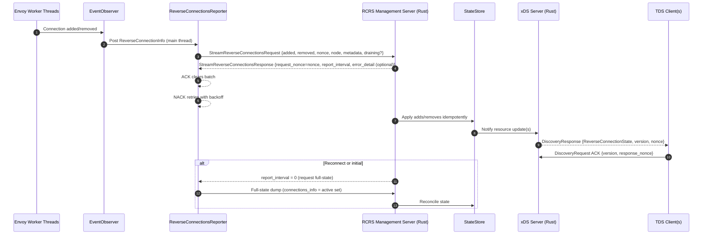

## Reverse Connection Reporting Service (RCRS) – Low-Level Design

### Overview
This document specifies how Envoy will capture reverse connection lifecycle events and report them over the Reverse Connections Reporting Service (RCRS), and how a Rust management sidecar will receive these events and expose them via an xDS-compatible API to Tunnel Discovery Service (TDS) clients.

- **Proto**: `envoy/service/reverse_tunnel/v3/rcrs.proto`
- **Key messages**:
  - `StreamReverseConnectionsRequest { node, connections_info[], removed_connections[], metadata, listener_draining, nonce }`
  - `StreamReverseConnectionsResponse { node, report_interval, request_nonce, error_detail }`
  - `ReverseConnectionInfo { TunnelInitiatorIdentity connection_identifier, Timestamp timestamp }`


### Goals
- Envoy streams reverse-connection add/remove events to a management server.
- Management server ACKs/NACKs and can control report interval.
- A Rust sidecar consumes RCRS streams and serves an xDS interface so other clients (TDS) can watch reverse connection state.


## Architecture

### High-level flow
1. Envoy acceptor tracks reverse connection sockets (on cloud Envoy).
2. Envoy reporter batches events and streams them to management via RCRS.
3. Rust management server applies updates, persists state, and ACKs/NACKs.
4. Rust xDS server publishes the current state as watchable resources to TDS clients.

### Existing Envoy integration points
- `source/extensions/bootstrap/reverse_tunnel/reverse_tunnel_acceptor.cc`
  - `UpstreamSocketManager::addConnectionSocket(...)` → connection added
  - `UpstreamSocketManager::markSocketDead(fd)` → connection removed
  - Gauges maintained via `ReverseTunnelAcceptorExtension::updateConnectionStats(...)`
- `source/extensions/bootstrap/reverse_tunnel/grpc_reverse_tunnel_service.cc`
  - Handshake service establishes tunnels and registers sockets into `UpstreamSocketManager`


### Message Flow Diagram



### Class and State Diagrams (Envoy)

#### Class Diagram
```mermaid
classDiagram
class ReverseTunnelAcceptorExtension {
  +onServerInitialized()
  +getLocalRegistry()
  +updateConnectionStats(node_id, cluster_id, increment)
}
class ReverseConnectionsReporter {
  +start()
  +stop()
  +enqueueAdded(info)
  +enqueueRemoved(info)
  +flush()
  +onResponse(resp)
  -openStream()
  -scheduleTimer()
  -updateInterval(duration)
  -backoff()
}
class ReverseConnectionsEventObserver {
  <<interface>>
  +onConnectionAdded(info)
  +onConnectionRemoved(info)
}
class UpstreamSocketManager {
  +addConnectionSocket(node_id, cluster_id, socket, ping_interval, rebalanced)
  +markSocketDead(fd)
  +getConnectionSocket(node_id)
  +pingConnections()
}
class UpstreamReverseConnectionIOHandle {
  +connect(address)
  +close()
}
class GrpcReverseTunnelService {
  +EstablishTunnel(request) EstablishTunnelResponse
}
class DrainManager {
  +startDrainSequence()
}

ReverseTunnelAcceptorExtension --> ReverseConnectionsReporter : owns
UpstreamSocketManager ..> ReverseConnectionsEventObserver : notifies
ReverseConnectionsEventObserver --> ReverseConnectionsReporter : posts events
GrpcReverseTunnelService --> UpstreamSocketManager : registers sockets
UpstreamSocketManager --> UpstreamReverseConnectionIOHandle : returns IO handle
ReverseTunnelAcceptorExtension ..> DrainManager : subscribes
ReverseConnectionsReporter ..> "gRPC AsyncClient" : RCRS stream
```

#### Reporter State Machine

```mermaid
stateDiagram-v2
state "Disconnected" as DISCONNECTED
state "Connecting" as CONNECTING
state "Streaming" as STREAMING
state "WaitingForAck" as WAIT_ACK
[*] --> DISCONNECTED
DISCONNECTED --> CONNECTING : start or retry backoff
CONNECTING --> STREAMING : stream established; got initial response
CONNECTING --> DISCONNECTED : connect error; backoff
STREAMING --> WAIT_ACK : send batch due to timer or threshold; set nonce
WAIT_ACK --> STREAMING : ACK with matching nonce; clear batch
WAIT_ACK --> STREAMING : NACK with error_detail; schedule backoff; retain batch
STREAMING --> DISCONNECTED : stream closed or error
STREAMING --> STREAMING : report_interval update; reschedule timer
STREAMING --> STREAMING : drain flag changed; include on next send
```



## Envoy-side Design

### Components
- **ReverseConnectionsReporter** (new)
  - Owns the bi-di gRPC stream to RCRS.
  - Batches added/removed events, sets `nonce`, manages ACK/NACK, backoff, and timers.
  - Lives on the main thread; interacts with Envoy gRPC async client.
  - Configurable via a new bootstrap extension config (see Config section).

- **ReverseConnectionsEventObserver** (new)
  - Thread-safe observer interface notified by worker threads when sockets are added/removed.
  - Posts events to the reporter on the main thread dispatcher.

### Data model (Envoy process memory)
- Pending batch:
  - `pending_added: vector<ReverseConnectionInfo>`
  - `pending_removed: vector<ReverseConnectionInfo>`
  - `last_sent_nonce: string`
  - `last_acked_nonce: optional<string>`
- Each `ReverseConnectionInfo.connection_identifier` contains `{ tenant_id, cluster_id, node_id }`.
  - `tenant_id` sourced from bootstrap config.
  - `cluster_id` and `node_id` from `UpstreamSocketManager` contexts.

### Lifecycle and concurrency
- Worker thread events → `ReverseConnectionsEventObserver::onConnectionAdded/Removed(...)` → post to main thread reporter queue.
- Reporter timer fires based on last `report_interval` (or size threshold) and sends a request with a new `nonce`.
- Responses:
  - If `request_nonce` matches the last sent nonce and no `error_detail` → ACK → clear the corresponding batch entries.
  - If `error_detail` is set → NACK → retain events and retry with backoff.

### Draining behavior
- Subscribe to server drain manager. When entering graceful drain, set `listener_draining = true` and include it on subsequent requests. This signals the control plane to avoid scheduling new tunnels to this Envoy.

### Error handling and reconnects
- Stream loss: reconnect with exponential backoff. On reconnect, send an initial empty request to receive `report_interval`. If server replies with `report_interval = 0`, immediately send a full-state dump (see below).
- NACK: apply capped exponential backoff and resend the same events as a new request (fresh nonce) until ACKed.

### Full-state dump (reconciliation)
- When `report_interval = 0` is received, Envoy should report the full set of active reverse connections immediately. Build `connections_info` by enumerating active sockets from `UpstreamSocketManager` and send with an empty `removed_connections`.

### Envoy bootstrap config (new extension)
- Introduce a bootstrap extension to configure the reporter client.
  - Proto: `envoy.extensions.bootstrap.reverse_tunnel.v3.ReverseConnectionsReporterConfig`
  - Fields:
    - `envoy.config.core.v3.GrpcService grpc_service` (RCRS target cluster)
    - `google.protobuf.Duration initial_report_interval` (default 30s)
    - `google.protobuf.Struct metadata` (optional)
    - `bool include_listener_draining` (default true)
    - `uint32 max_batch_size` (default e.g., 10000)

Example YAML snippet:
```yaml
bootstrap_extensions:
  - name: envoy.bootstrap.reverse_tunnel.reverse_connections_reporter
    typed_config:
      "@type": type.googleapis.com/envoy.extensions.bootstrap.reverse_tunnel.v3.ReverseConnectionsReporterConfig
      grpc_service:
        envoy_grpc:
          cluster_name: rcrs_management
      initial_report_interval: 30s
      include_listener_draining: true

static_resources:
  clusters:
    - name: rcrs_management
      type: STATIC
      load_assignment:
        cluster_name: rcrs_management
        endpoints:
          - lb_endpoints:
              - endpoint:
                  address:
                    socket_address: { address: 127.0.0.1, port_value: 18080 }
```


## Rust Management Sidecar

### Processes
- RCRS server: implements `ReverseConnectionsReportingService.StreamReverseConnections`.
- xDS server: serves a custom resource type that reflects current reverse-connection state to TDS clients.
- Shared state store for active connections and versioning.

### State model
- Identity: `(tenant_id, cluster_id, node_id)`
- For each tenant/cluster resource:
  - `active_connections: set<ReverseConnectionInfo>` (or counts if multiple per node)
  - `updated_at: Timestamp`
  - `version: u64` (monotonic)

### RCRS server behavior
1. On new stream: receive initial request, reply with `StreamReverseConnectionsResponse { node, report_interval }`.
2. For each request:
   - Validate `nonce` and identity; apply `connections_info` (add) and `removed_connections` (remove) idempotently.
   - Update state and version; notify xDS watchers for affected resources.
   - Respond with `request_nonce = <received nonce>` and optionally adjusted `report_interval`. Include `error_detail` to NACK invalid updates.
3. On stream end: keep state; optionally apply TTL cleanup policies.

### xDS server design (SotW)
- Resource type URL: `type.googleapis.com/envoy.service.reverse_tunnel.v3.ReverseConnectionState`
- Resource name: `tenant/{tenant}/cluster/{cluster}` (node-granular variants allowed if required).
- Message (custom):
```proto
syntax = "proto3";
package envoy.service.reverse_tunnel.v3;

import "google/protobuf/timestamp.proto";
import "envoy/service/reverse_tunnel/v3/rcrs.proto";

message ReverseConnectionState {
  repeated ReverseConnectionInfo active_connections = 1;
  google.protobuf.Timestamp updated_at = 2;
}
```
- Watch model:
  - TDS clients issue `DiscoveryRequest` for the above `type_url` with optional `resource_names` filters.
  - Server pushes `DiscoveryResponse` on updates with incremented `version_info` (stringified u64) and `nonce`.
  - Clients ACK with matching `version_info` and `response_nonce`.

### Rust implementation outline
- Crates: `tonic`, `prost`, `tokio`, `dashmap`, `tokio-stream`.
- Modules:
  - `rcrs::service`: tonic service impl for `StreamReverseConnections`; ACK/NACK, interval control.
  - `xds::discovery`: SotW DiscoveryService for the custom type; manages per-resource watchers.
  - `state::store`: `DashMap<ResourceName, ReverseConnectionState>` + per-resource version and notify.
  - `proto`: generated prost types for Envoy RCRS and custom `ReverseConnectionState`.
- Backpressure/coalescing: consolidate rapid RCRS updates into ≤100ms windows before pushing xDS updates.

### Ports/config
- RCRS gRPC server port: 18080 (example)
- xDS gRPC server port: 18000 (example)
- Configure via env vars/CLI flags; Envoy points its reporter to the RCRS port.


## Sequences

### Add/remove event end-to-end
1. Envoy worker accepts a reverse connection → `UpstreamSocketManager::addConnectionSocket(...)` → observer posts `onConnectionAdded(info)`.
2. Reporter batches; timer fires; sends `StreamReverseConnectionsRequest { connections_info[], nonce }`.
3. Rust RCRS applies, updates store, ACKs with `request_nonce` and optional `report_interval`.
4. Reporter clears ACKed batch.
5. xDS server pushes updated `ReverseConnectionState` to watchers; clients ACK.

### Reconnect with full-state dump
1. RCRS stream re-established.
2. Server replies with `report_interval = 0` to request immediate full state.
3. Envoy reporter enumerates active sockets and sends full `connections_info` snapshot.
4. Server reconciles and ACKs; xDS state updates and is pushed.


## Edge Cases and Policies
- Duplicate events: server applies idempotently using `(tenant, cluster, node)` identity in a set.
- Stream loss: retry with exponential backoff; do not drop pending events until ACKed.
- Large state: shard resources by cluster or paginate across multiple resource names; cap per-message size.
- Draining: propagate `listener_draining` via RCRS metadata; optionally reflect in xDS resource labels.


## Testing Plan
### Envoy
- Unit: reporter batching, nonce/ACK/NACK handling, interval changes, drain flag.
- Integration: add/remove sockets produce events; full-state dump on `report_interval = 0`.

### Rust sidecar
- Unit: RCRS stream handler, validation, ACK/NACK logic, store updates.
- Integration: xDS watchers receive updates on store mutations; ACK handling and versioning.


## Implementation Notes
- Envoy reporter should use the existing asynchronous gRPC client utilities and run all stream operations on the main dispatcher.
- Observer should only cross thread boundaries via dispatcher `post(...)` calls.
- Keep `ReverseConnectionInfo.timestamp` using Envoy system time in UTC; server trusts client time only for display and uses its own for `updated_at`.


## References
- `api/envoy/service/reverse_tunnel/v3/rcrs.proto`
- `api/envoy/service/reverse_tunnel/v3/reverse_tunnel_handshake.proto`
- `source/extensions/bootstrap/reverse_tunnel/reverse_tunnel_acceptor.cc`
- `source/extensions/bootstrap/reverse_tunnel/grpc_reverse_tunnel_service.cc`


